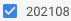

# Portfolio Alex Miguel

|   Descrição	|   Como utilizar 	|
|---	|---	|
| Projeto para salvar e reaproveitar componentes React e funções JavaScript. O objetivo desse projeto é poder aproveitar esses componentes em qualquer projeto, basta copiar e fazer pequenas alterações de acordo com o projeto. |  Desenvolvido em ReactJS V17 Node V12 com as bibliotecas: styled-components V5, typescript V4. Para utiliza-lo localmente, basta clonar o projeto e no terminal digitar **sudo yarn** para instalar todas as depêndencias do projeto, e depois é só executar o comando **yarn start** e o projeto sera aberto no browser default.	|

---
&nbsp; 
###  Componentes
* CheckboxBlueWithDescription
> Um checkbox simples com descrição

&nbsp;  
#### Desenvolvido por
**[Alex Miguel](https://www.linkedin.com/in/alexmiguel95/)**

alexmiguel95@gmail.com
